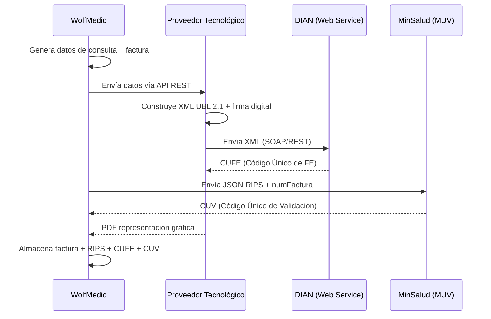

# Plan de Implementación: RIPS y Facturación Electrónica DIAN

Investigación y diseño para integrar los **Registros Individuales de Prestación de Servicios de Salud (RIPS)** y la **Facturación Electrónica de Venta (FEV)** en WolfMedic, con el objetivo de cobrar por cada consulta odontológica.

---

## 1. Marco Normativo Vigente

| Norma | Entidad | Qué regula |
|---|---|---|
| **Resolución 2275 / 2023** | MinSalud | Estructura RIPS en **JSON** como soporte de la FEV en salud |
| **Resolución 1884 / 2024** | MinSalud | Cronograma de implementación obligatoria del Mecanismo Único de Validación (MUV) |
| **Resolución 000165 / 2023** | DIAN | Anexo técnico FEV en formato **UBL 2.1 XML** |
| **Resolución 000202 / 2025** | DIAN | Simplificación de datos del adquirente en FEV |
| **Resolución 510 / 2022** | MinSalud | Campos adicionales del sector salud en el XML de la FEV |

> [!IMPORTANT]
> Desde abril de 2025, **todos los prestadores de baja complejidad y profesionales independientes** deben usar el MUV para validar RIPS. WolfMedic debe cumplir esto.

---

## 2. ¿Qué es RIPS y cómo funciona ahora?

Los RIPS son el registro obligatorio de cada atención en salud. Bajo la Resolución 2275/2023 son un archivo **JSON** que acompaña a cada factura electrónica.

### Estructura del JSON RIPS (simplificada)

```
transacción (objeto raíz)
├── numDocumentoIdObligado        (NIT del prestador)
├── numFactura                    (debe coincidir con la FEV DIAN)
├── tipoNota                      (null / NC / ND / NA)
├── usuarios[]                    (array de pacientes atendidos)
│   ├── tipoDocumentoIdentificacion
│   ├── numDocumentoIdentificacion
│   ├── fechaNacimiento
│   └── servicios
│       ├── consultas[]           ← AC (Archivo de Consultas)
│       ├── procedimientos[]      ← AP (Archivo de Procedimientos)
│       ├── urgencias[]
│       ├── hospitalizacion[]
│       ├── medicamentos[]
│       ├── otrosServicios[]
│       └── recienNacidos[]
```

### Campos clave de una **consulta odontológica** (AC)

| Campo | Ejemplo | Descripción |
|---|---|---|
| `codPrestador` | `110012345` | Código REPS del prestador |
| `fechaInicioAtencion` | `2026-03-25` | Fecha de la consulta |
| `codigoConsulta` (CUPS) | `890203` | Primera vez odontología general |
| `modalidadGrupoServicioTecSal` | `01` | Intramural |
| `grupoServicios` | `01` | Consulta general |
| `codServicio` | `890203` | Código CUPS del servicio |
| `finalidadTecnologiaSalud` | `11` | Diagnóstico |
| `causaMotivoAtencion` | `25` | Enfermedad general |
| `codDiagnosticoPrincipal` | `K021` | CIE-10 (caries dental) |
| `tipoDiagnosticoPrincipal` | `1` | Impresión diagnóstica |
| `vrServicio` | `50000` | Valor cobrado de la consulta |

### Códigos CUPS relevantes para odontología

| Código | Descripción |
|---|---|
| `890203` | Consulta de primera vez – odontología general |
| `890303` | Consulta de control – odontología general |
| `890703` | Consulta de urgencias – odontología general |

---

## 3. Facturación Electrónica DIAN (FEV)

### Flujo completo



### Requisitos técnicos de la FEV

- **Formato**: XML bajo estándar UBL 2.1
- **Firma Digital**: Obligatoria (certificado digital vigente)
- **Campos adicionales salud** (Res. 510/2022):
  - Código del prestador de servicios de salud
  - Tipo y número de documento del paciente
  - Régimen (contributivo / subsidiado / particular)
  - Número de autorización
  - Copagos, cuotas moderadoras
  - Código CUPS de cada servicio

> [!TIP]
> **Recomendación**: Usar un **Proveedor Tecnológico autorizado DIAN** (como Carvajal, Cadena, The Factory HKA, Siigo, Alegra, etc.) en lugar de implementar la generación del XML UBL 2.1 y la firma digital internamente. La mayoría ofrecen **APIs REST** que simplifican enormemente la integración.

---

## 4. Propuesta de Arquitectura para WolfMedic

Siguiendo las reglas de [ARCHITECTURE.md](file:///d:/OD/OneDrive/Desarr/Wolfgis/GOI/ARCHITECTURE.md) (Routes → Control → Repo):

### 4.1 Nuevos módulos Backend (`back`)

| Módulo | Routes | Control | Repo |
|---|---|---|---|
| **Facturación** | `facturacion_routes.py` | `facturacion_control.py` | `facturacion_repo.py` |
| **RIPS** | `rips_routes.py` | `rips_control.py` | `rips_repo.py` |
| **Tarifas** | `tarifas_routes.py` | `tarifas_control.py` | `tarifas_repo.py` |

### 4.2 Nuevas tablas en la base de datos `goi`

```sql
-- Tarifas por servicio (CUPS)
CREATE TABLE tarifas (
    id SERIAL PRIMARY KEY,
    codigo_cups VARCHAR(10) NOT NULL,
    descripcion TEXT NOT NULL,
    valor NUMERIC(12,2) NOT NULL,
    iva_porcentaje NUMERIC(4,2) DEFAULT 0,
    activo BOOLEAN DEFAULT TRUE,
    created_at TIMESTAMP DEFAULT NOW()
);

-- Facturas emitidas
CREATE TABLE facturas (
    id SERIAL PRIMARY KEY,
    numero_factura VARCHAR(20) UNIQUE NOT NULL,
    prefijo VARCHAR(10),
    fecha_emision TIMESTAMP NOT NULL DEFAULT NOW(),
    paciente_id INTEGER REFERENCES pacientes(id),
    profesional_id INTEGER REFERENCES profesionales(id),
    cita_id INTEGER REFERENCES citas(id),
    subtotal NUMERIC(12,2) NOT NULL,
    iva NUMERIC(12,2) DEFAULT 0,
    total NUMERIC(12,2) NOT NULL,
    copago NUMERIC(12,2) DEFAULT 0,
    cuota_moderadora NUMERIC(12,2) DEFAULT 0,
    estado VARCHAR(20) DEFAULT 'pendiente',  -- pendiente, enviada, validada, anulada
    cufe VARCHAR(100),         -- Código Único FE (DIAN)
    cuv VARCHAR(100),          -- Código Único Validación (RIPS)
    xml_url TEXT,
    pdf_url TEXT,
    created_at TIMESTAMP DEFAULT NOW()
);

-- Detalle de servicios facturados
CREATE TABLE factura_items (
    id SERIAL PRIMARY KEY,
    factura_id INTEGER REFERENCES facturas(id) ON DELETE CASCADE,
    codigo_cups VARCHAR(10) NOT NULL,
    descripcion TEXT NOT NULL,
    cantidad INTEGER DEFAULT 1,
    valor_unitario NUMERIC(12,2) NOT NULL,
    iva NUMERIC(12,2) DEFAULT 0,
    valor_total NUMERIC(12,2) NOT NULL
);

-- Log de RIPS enviados
CREATE TABLE rips_log (
    id SERIAL PRIMARY KEY,
    factura_id INTEGER REFERENCES facturas(id),
    json_rips JSONB NOT NULL,
    estado VARCHAR(20) DEFAULT 'generado',  -- generado, enviado, aprobado, rechazado
    cuv VARCHAR(100),
    respuesta_muv JSONB,
    enviado_at TIMESTAMP,
    created_at TIMESTAMP DEFAULT NOW()
);
```

### 4.3 Nuevas pantallas Frontend

| Pantalla | Descripción |
|---|---|
| **Tarifario** | ABM de servicios con código CUPS y valor |
| **Facturar Consulta** | Al finalizar una cita, generar factura con ítems CUPS |
| **Historial de Facturas** | Listado con estado DIAN + RIPS, filtros por fecha/paciente |
| **Detalle de Factura** | Ver PDF, estado CUFE/CUV, reenviar si falló |

---

## 5. Plan de Fases

### Fase 1 — Base de Datos y Tarifario *(1-2 semanas)*
- Crear tablas (`tarifas`, `facturas`, `factura_items`, `rips_log`)
- CRUD de tarifario (códigos CUPS odontológicos)
- Pantalla de administración de tarifas en el frontend

### Fase 2 — Generación de Facturas *(2-3 semanas)*
- Flujo "Facturar" al cerrar/completar una cita
- Generación automática del número de factura (prefijo + consecutivo)
- Cálculo de subtotal, IVA, copagos
- Almacenamiento en BD y pantalla de historial

### Fase 3 — Generación de RIPS JSON *(1-2 semanas)*
- Construcción del JSON según Res. 2275/2023
- Envío al MUV de MinSalud
- Almacenamiento del CUV y respuesta

### Fase 4 — Integración con Proveedor Tecnológico DIAN *(2-3 semanas)*
- Seleccionar proveedor (ej: Siigo, Alegra, Carvajal, dataico)
- Integrar API REST del proveedor
- Enviar factura → recibir CUFE + PDF
- Almacenar respuesta y enlazar con factura

### Fase 5 — Polishing y Compliance *(1 semana)*
- Validaciones cruzadas factura ↔ RIPS
- Notas crédito / débito
- Reportes y auditoría

---

## 6. Decisiones que requieren tu input

> [!WARNING]
> Antes de comenzar la implementación necesito que definas:

1. **¿Proveedor Tecnológico DIAN?** ¿Ya tienes contratado alguno, o prefieres que investigue opciones económicas con API REST?
2. **¿Régimen tributario?** ¿El consultorio factura como régimen simplificado o como responsable de IVA?
3. **¿Tipo de pacientes?** ¿Se atienden pacientes particulares (pago directo), EPS (contributivo/subsidiado), o ambos?
4. **¿Prefijo y rango de numeración?** ¿Ya tienes autorización de numeración de la DIAN?
5. **¿Empezamos por Fase 1 (tarifario)?** O prefieres que aborde primero otra fase.
